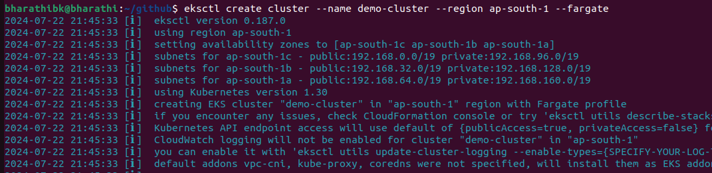
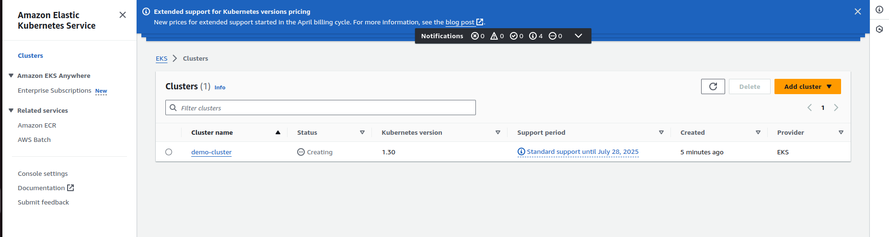
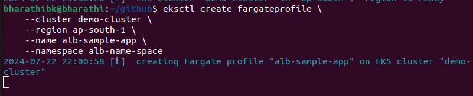
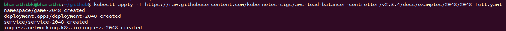
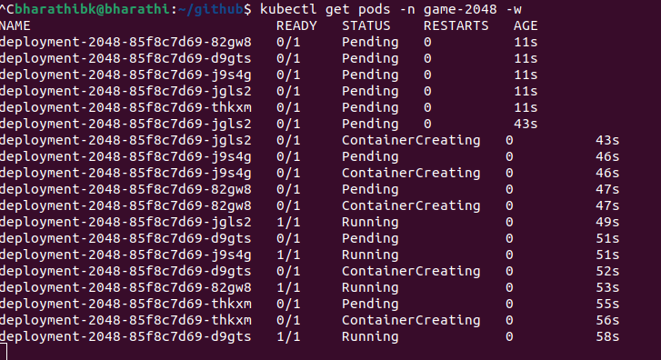
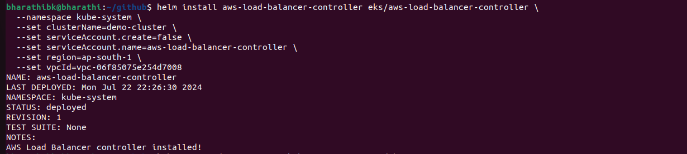
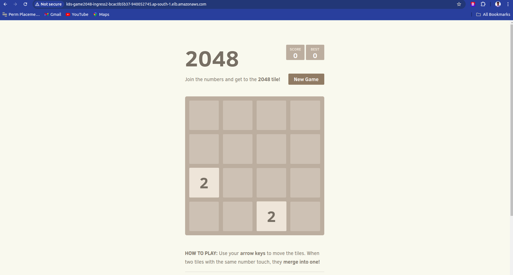
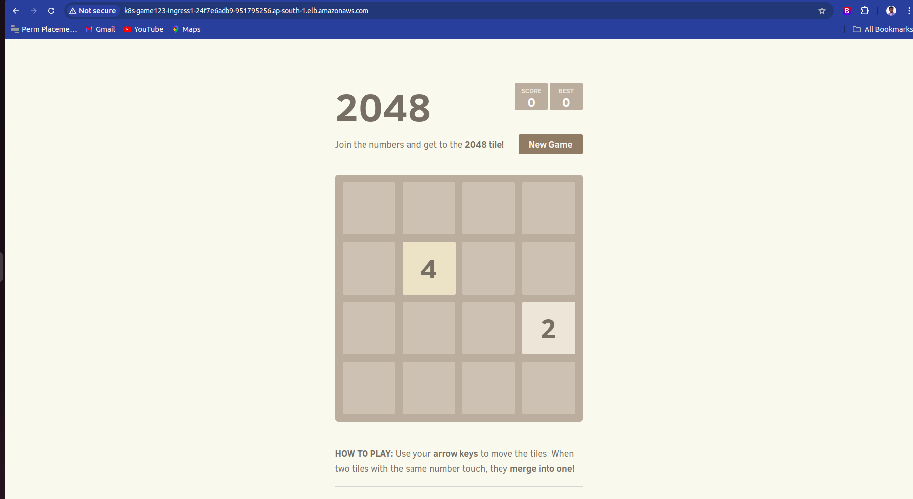

# K8S eks project 
## Prerequisite  (install eks ctl on your local and install kubectl ctl )

## Step 1

### Run this command to create the cluster 

#### eksctl create cluster --name demo-cluster --region ap-south-1 --fargate (note: it will take more than 10min)
### Terminal view

### aws console

## Step 2

### Run this command for update kubeconf to your local

#### aws eks update-kubeconfig --name demo-cluster --region ap-south-1

## Step 3 

### create a fargate profile 

#### eksctl create fargateprofile \
    --cluster demo-cluster \
    --region ap-south-1 \
    --name alb-sample-app \
    --namespace alb-name-space

## Step 4 (deploy the application)

### deploy the deployment,service,ingress

#### kubectl apply -f https://raw.githubusercontent.com/kubernetes-sigs/aws-load-balancer-controller/v2.5.4/docs/examples/2048/2048_full.yaml

## Step 5 view the pod

##   kubectl get pods -n game-2048

## Attach OIDC

eksctl utils associate-iam-oidc-provider --cluster $cluster_name --approve

## Download iam policy 

curl -O https://raw.githubusercontent.com/kubernetes-sigs/aws-load-balancer-controller/v2.5.4/docs/install/iam_policy.json

## Create iam policy 

#### aws iam create-policy \
#### --policy-name AWSLoadBalancerControllerIAMPolicy \
#### --policy-document file://iam_policy.json

## create iam role

### eksctl create iamserviceaccount \
### --cluster=<your-cluster-name> \
  --namespace=kube-system \
  --name=aws-load-balancer-controller \
  --role-name AmazonEKSLoadBalancerControllerRole \
  --attach-policy-arn=arn:aws:iam::<your-aws-account-id>:policy/AWSLoadBalancerControllerIAMPolicy \
  --approve

## Deploy ALB controller

### helm repo add eks https://aws.github.io/eks-charts

## Update the repo

### helm repo update eks

## Install the alb on cluster

#### helm install aws-load-balancer-controller eks/aws-load-balancer-controller \            
  -n kube-system \
  --set clusterName=<your-cluster-name> \
  --set serviceAccount.create=false \
  --set serviceAccount.name=aws-load-balancer-controller \
  --set region=<region> \
  --set vpcId=<your-vpc-id>

## Verify that the deployments are running.

# kubectl get deployment -n kube-system aws-load-balancer-controller

## Finally first one completed : alb 1
### get the dns name on ec2 alb 

## Second same step alb 2  (run deployment2.yml file by using kubectl -f deployment2.yml)
### get the dns name on ec2 alb

## Delete your cluster

### eksctl delete cluster --name demo-cluster --region ap-south-1

