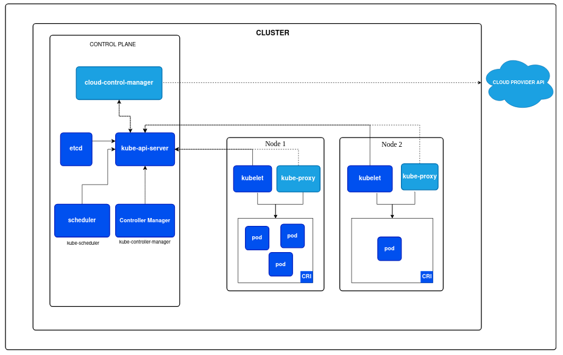

# Kubernetes Architecture

# Controlplane
## Kubeapi server

- user commands
- Node
- Components

## Controller manager

- scaling
- Node monitoring
- Job monitoring
- Ensure desire state

## Scheduler

- node affinity
- taints & tolerations
- pod affinity & pod anti affinity

## etcd (et cetera distributed)

- data base (storing k8s configuration data) 

## Cloud control manager

- api for cloud providers like (aws azure and gcp)
- example(load balancer)

# Worker plane

## kubelet
- check pods
- report status
- restart the failuer pods with a help of container run time
- talk to conatiner run time

## Kubeproxy

- network trafic manager
- balancing the load