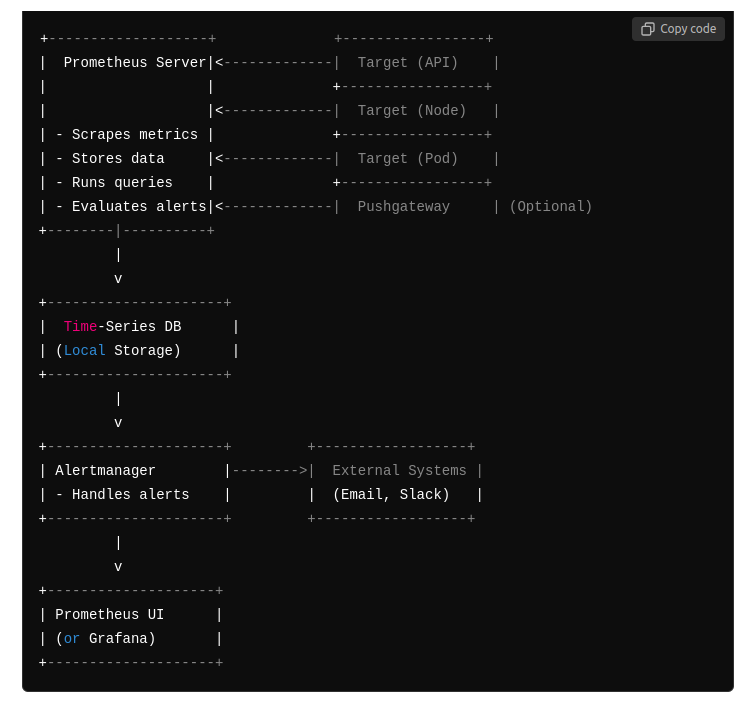

# Prometheus architecture





# Commands

## install heml chart

```
curl https://raw.githubusercontent.com/helm/helm/master/scripts/get-helm-3 | bash

```

## add prometheus to the helm chart repo 

```
helm repo add prometheus-community https://prometheus-community.github.io/helm-charts
helm repo update
```

## install prometheus

```
helm install prometheus prometheus-community/prometheus
```

## check the promotheus pod

```
kubectl get pods -A

```

## check the prometheus pod and service

```
kubectl get svc
kubectl get pods
```

## add node port ip to the prometheus pod 
```
kubectl patch svc prometheus-server -p '{"spec": {"type": "NodePort", "ports": [{"port": 80, "nodePort": 30080}]}}'
```


## promql

```
count(kube_pod_status_phase{phase="Running"})
```


# Grafana installation


##  grafana added to the helm chart 

```
helm repo add grafana https://grafana.github.io/helm-charts
```

##  update helm chart and install grafana

```
helm repo update
helm install grafana grafana/grafana --namespace monitoring
```

## change the node port mode using patch command

```
kubectl patch svc grafana -n <namespace> -p '{"spec": {"type": "NodePort", "ports": [{"port": 80, "nodePort": 32000}]}}'


```

## grafana prebuild dashboard ids

```
Dashboard ID 6417 for Kubernetes Cluster Monitoring.
Dashboard ID 3131 for detailed Pod Monitoring.
Dashboard ID 1621 for Deployment Monitoring.
```